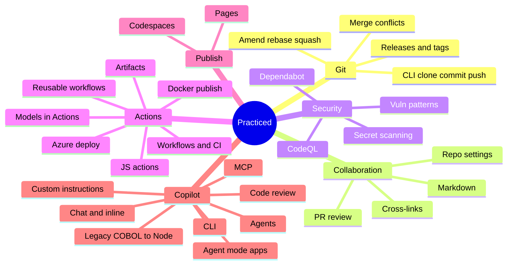

# Knowledge map

What finished exercises made me **do**, versus what is still open. Not a credential.

---

## Practiced

| Area | What I actually did | In |
|:--|:--|:--|
| Git | Repo, branch, commit, PR; CLI clone/stage/push; amend, rebase, squash; conflict markers; tags and releases | Intro GitHub · Intro Git · Change history · Conflicts · Release workflow |
| Collaboration | Markdown in issues/docs; review comments/suggestions; cross-links; access and branch protection | Markdown · Review PRs · Connect the dots · Repo management |
| Security | Dependabot; secret scanning; CodeQL + language matrix; common vuln patterns | Supply chain · Secret scanning · CodeQL · CodeQL matrix · Secure Code Game |
| Actions | First workflow; tests in CI; reusable workflows; JS actions; Docker publish; Azure deploy; models in Actions; **upload/preview/reuse workflow artifacts** | Hello Actions · Test with Actions · Reusable · JS actions · Docker · Azure · AI in Actions · AI-powered actions · **Workflow artifacts** |
| Publish | GitHub Pages site; Codespaces (quota now exhausted) | Pages · Codespaces |
| Copilot | Inline + chat; CLI scaffold; MCP; multi-agent; agentic workflow; PR review + rulesets; custom instructions / skills / agents; agent-mode multi-tier app; COBOL → Node modernization | Getting started · Copilot CLI · MCP · Orchestration · Agentic workflows · Code review · Customize · Agent mode · Modernize |

---

## Not practiced yet

| Gap | Course | Blocker |
|:--|:--|:--|
| Copilot App: idea → session → merged PR | [Idea to Merge](https://github.com/skills/idea-to-merge-with-the-copilot-app) | **Next** — Copilot App + Node 22 locally |
| Quality gates, coverage thresholds, rulesets | [Ship with quality](https://github.com/skills/ship-with-quality) | Parked — GitHub Code Quality is **org-only**, not personal accounts |
| Assign issues to Copilot coding agent | [Expand your team](https://github.com/skills/expand-your-team-with-copilot) | Parked — usually team / org |
| Copilot Spaces | [Spaces](https://github.com/skills/scale-institutional-knowledge-using-copilot-spaces) | Parked — product access |
| Spark natural-language apps | [Idea to App with Spark](https://github.com/skills/idea-to-app-with-spark) | Parked — Spark preview + paid Copilot |
| ADO → GitHub CLI migrate | [Migrate ADO](https://github.com/skills/migrate-ado-repository) | Parked — copy exists; Codespaces / ADO |

Archived (not chasing): Copilot + Codespaces · first Copilot extension. See [CATALOG.md](CATALOG.md).
