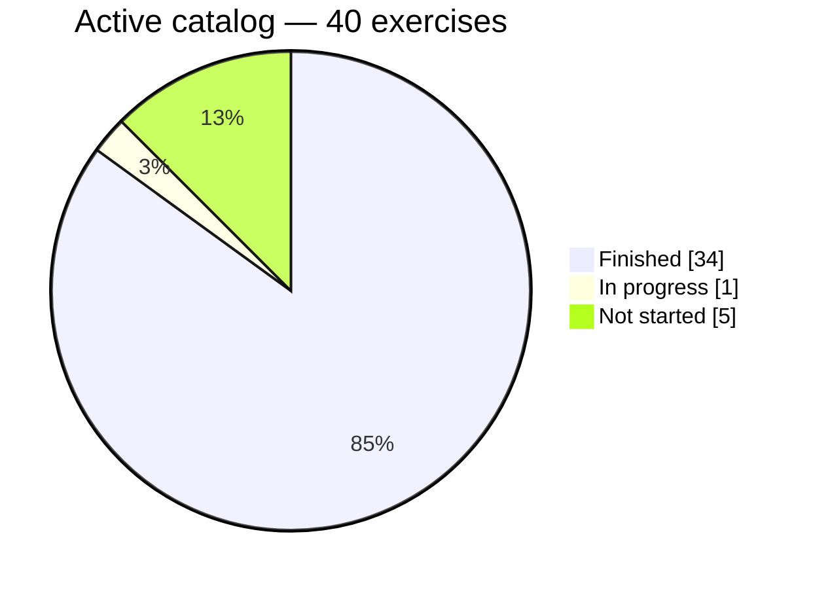

[Dashboard](#dashboard) · [Finished](#finished) · [Leftover](#leftover) · [Catalog](CATALOG.md) · [Knowledge](KNOWLEDGE.md) · [Next](ROADMAP.md)

> [!NOTE]
> Personal tracker of [GitHub Skills](https://learn.github.com/skills/) exercises I ran in my own copies. Numbers mean **finished copies**, not a test, badge, or official GitHub record.

## Dashboard

```mermaid
xychart-beta
    title Finished vs leftover by track
    x-axis [Git, Security, Actions, Publish, Copilot, Cloud]
    y-axis 0 --> 12
    bar [8, 6, 9, 2, 9, 0]
    bar [0, 0, 1, 0, 3, 2]
```

First bars = finished · second bars = leftover.

| | Count |
|:--|--:|
| Active catalog | 40 |
| Finished | **34** |
| In progress | 1 |
| Not started | 5 |
| Archived official (not queued) | 2 |

Last logged: **29 Aug 2026** · Workflow artifacts · Catalog checked **23 Aug 2026**

## Leftover — 6

| Status | Course | Start |
|:--|:--|:--|
| **Next** | Idea to Merge with the Copilot App | [Course](https://github.com/skills/idea-to-merge-with-the-copilot-app) · [Copy](https://github.com/new?template_owner=skills&template_name=idea-to-merge-with-the-copilot-app&owner=%40me&name=skills-idea-to-merge-with-the-copilot-app&description=Exercise:+Idea+to+Merge+with+the+Copilot+App&visibility=public) |
| Not started | Expand team with Copilot | parked — coding agent / org |
| Not started | Copilot Spaces | parked — product access |
| Not started | Idea to App with Spark | parked — Spark preview |
| Not started | Ship with quality | parked — org Code Quality only |
| In progress | Migrate ADO repository | parked — [copy](https://github.com/blackhebrewisraeli/skills-migrate-ado-repository) · Codespaces / ADO |

How to run the next one, and why the others are parked: **[ROADMAP.md](ROADMAP.md)**

## Finished — 34

Click a track. Each row is the practice copy.

<b>Git &amp; GitHub basics</b> · 8 / 8

| Practice | Copy |
|:--|:--|
| Introduction to GitHub | [skills-introduction-to-github](https://github.com/blackhebrewisraeli/skills-introduction-to-github) |
| Introduction to Git | [skills-introduction-to-git](https://github.com/blackhebrewisraeli/skills-introduction-to-git) |
| Communicate using Markdown | [skills-communicate-using-markdown](https://github.com/blackhebrewisraeli/skills-communicate-using-markdown) |
| Review Pull Requests | [skills-review-pull-requests](https://github.com/blackhebrewisraeli/skills-review-pull-requests) |
| Connect the Dots | [skills-connect-the-dots](https://github.com/blackhebrewisraeli/skills-connect-the-dots) |
| Resolve Merge Conflicts | [skills-resolve-merge-conflicts](https://github.com/blackhebrewisraeli/skills-resolve-merge-conflicts) |
| Change Commit History | [skills-change-commit-history](https://github.com/blackhebrewisraeli/skills-change-commit-history) |
| Release-based Workflow | [skills-release-based-workflow](https://github.com/blackhebrewisraeli/skills-release-based-workflow) |

<b>Repository management &amp; security</b> · 6 / 6

| Practice | Copy |
|:--|:--|
| Introduction to Repository Management | [skills-introduction-to-repository-management](https://github.com/blackhebrewisraeli/skills-introduction-to-repository-management) |
| Secure your Repository Supply Chain | [skills-secure-repository-supply-chain](https://github.com/blackhebrewisraeli/skills-secure-repository-supply-chain) |
| Introduction to Secret Scanning | [skills-introduction-to-secret-scanning](https://github.com/blackhebrewisraeli/skills-introduction-to-secret-scanning) |
| Introduction to CodeQL | [skills-introduction-to-codeql](https://github.com/blackhebrewisraeli/skills-introduction-to-codeql) |
| Configure CodeQL Language Matrix | [skills-configure-codeql-language-matrix](https://github.com/blackhebrewisraeli/skills-configure-codeql-language-matrix) |
| Secure Code Game | [skills-secure-code-game](https://github.com/blackhebrewisraeli/skills-secure-code-game) |

<b>Automation with Actions</b> · 9 / 10

| Practice | Copy |
|:--|:--|
| Hello GitHub Actions | [skills-hello-github-actions](https://github.com/blackhebrewisraeli/skills-hello-github-actions) |
| Test with Actions | [skills-test-with-actions](https://github.com/blackhebrewisraeli/skills-test-with-actions) |
| Reusable Workflows | [skills-reusable-workflows](https://github.com/blackhebrewisraeli/skills-reusable-workflows) |
| Write JavaScript Actions | [skills-write-javascript-actions](https://github.com/blackhebrewisraeli/skills-write-javascript-actions) |
| Publish Docker Images | [skills-publish-docker-images](https://github.com/blackhebrewisraeli/skills-publish-docker-images) |
| Deploy to Azure | [skills-deploy-to-azure](https://github.com/blackhebrewisraeli/skills-deploy-to-azure) |
| AI in Actions | [skills-ai-in-actions](https://github.com/blackhebrewisraeli/skills-ai-in-actions) |
| Create AI-Powered Actions | [skills-create-ai-powered-actions](https://github.com/blackhebrewisraeli/skills-create-ai-powered-actions) |
| Workflow Artifacts | [skills-workflow-artifacts](https://github.com/blackhebrewisraeli/skills-workflow-artifacts) |

Open in this track: [Ship with quality](https://github.com/skills/ship-with-quality) (parked — org Code Quality).

<b>Dev environments &amp; publishing</b> · 2 / 2

| Practice | Copy |
|:--|:--|
| Code with Codespaces | [skills-code-with-codespaces](https://github.com/blackhebrewisraeli/skills-code-with-codespaces) |
| GitHub Pages | [skills-github-pages](https://github.com/blackhebrewisraeli/skills-github-pages) |

Azure deploy is counted under Actions.

<b>Copilot, agents &amp; AI</b> · 9 / 12

| Practice | Copy |
|:--|:--|
| Getting Started with GitHub Copilot | [skills-getting-started-with-github-copilot](https://github.com/blackhebrewisraeli/skills-getting-started-with-github-copilot) |
| Create Applications with the Copilot CLI | [skills-create-applications-with-the-copilot-cli](https://github.com/blackhebrewisraeli/skills-create-applications-with-the-copilot-cli) |
| Integrate MCP with GitHub Copilot | [skills-integrate-mcp-with-copilot](https://github.com/blackhebrewisraeli/skills-integrate-mcp-with-copilot) |
| Agent Orchestration | [skills-agent-orchestration-build-your-ai-dream-team](https://github.com/blackhebrewisraeli/skills-agent-orchestration-build-your-ai-dream-team) |
| Agentic Workflows That Read the Room | [skills-agentic-workflows-that-read-the-room](https://github.com/blackhebrewisraeli/skills-agentic-workflows-that-read-the-room) |
| Copilot Code Review | [skills-copilot-code-review](https://github.com/blackhebrewisraeli/skills-copilot-code-review) |
| Customize Your GitHub Copilot Experience | [skills-customize-your-github-copilot-experience](https://github.com/blackhebrewisraeli/skills-customize-your-github-copilot-experience) |
| Build Applications with Copilot Agent Mode | [skills-build-applications-w-copilot-agent-mode](https://github.com/blackhebrewisraeli/skills-build-applications-w-copilot-agent-mode) |
| Modernize Your Legacy Code with GitHub Copilot | [skills-modernize-your-legacy-code-with-github-copilot](https://github.com/blackhebrewisraeli/skills-modernize-your-legacy-code-with-github-copilot) |

What those exercises actually covered: **[KNOWLEDGE.md](KNOWLEDGE.md)** · Full official inventory: **[CATALOG.md](CATALOG.md)**

---

Status key

| Status | Meaning |
|:--|:--|
| Finished | I completed the exercise in my copy |
| In progress | A `skills-*` copy exists; steps still open |
| Not started | No finished copy |
| Parked | Paused (quota, product, or org-only) |
| Archived | Official course retired — not leftover practice |

<a href="https://github.com/blackhebrewisraeli">@blackhebrewisraeli</a> · Not an official GitHub document

