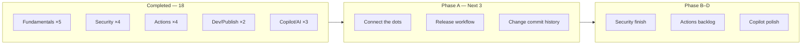

# 🗺️ GitHub Skills Learning Roadmap

> Personal study plan for [**GitHub Foundations**](https://learn.microsoft.com/en-us/credentials/certifications/github-foundations/) prep.  
> **Account:** GitHub Pro · **Logged practices:** 18 · **Last updated:** Review pull requests added

---

## Progress overview



| Track | Logged | Your repos (incl. not yet logged) |
|:------|:------:|:----------------------------------|
| 🌱 Fundamentals | 5 | +0 pending |
| 🛡️ Security | 4 | +0 pending |
| ⚙️ Automation | 4 | **+2 done** (`test-with-actions`, `publish-docker-images`) |
| ☁️ Dev & Publishing | 2 | +0 pending |
| 🤖 Copilot & AI | 3 | +1 done (`agentic-workflows…`, excluded from log) |

---

## How to run any practice (repeatable workflow)

| Step | Action |
|:----:|:-------|
| 1 | Go to [skills.github.com](https://skills.github.com/) or the `@skills` repo linked below |
| 2 | Click **Use this template** → **Create a new repository** |
| 3 | Choose **Public** (unlimited Actions minutes; recommended on Pro) |
| 4 | Open **Issues** — Mona posts Step 1 within ~20 seconds |
| 5 | Follow each issue/comment; open PRs when asked |
| 6 | Close the final issue → exercise complete |
| 7 | Ask to update [README.md](README.md) — new row + count bump |

---

## Phase A — Collaboration & Git depth *(do these next)*

**Goal:** Finish core collaboration + Git topics tested heavily on Foundations.

| Order | Practice | Duration | Start here | Why now |
|:-----:|:---------|:--------:|:-----------|:--------|
| **1** | [Connect the dots](https://github.com/skills/connect-the-dots) | ~30 min | [Start →](https://github.com/skills/connect-the-dots) | Links issues, PRs, and commits — maintainer workflow |
| **2** | [Release-based workflow](https://github.com/skills/release-based-workflow) | ~45 min | [Start →](https://github.com/skills/release-based-workflow) | Tags, versions, releases — professional repo hygiene |
| **3** | [Change commit history](https://github.com/skills/change-commit-history) | ~45 min | [Start →](https://github.com/skills/change-commit-history) | Amend, rebase, squash — Git exam essentials |

**After Phase A:** 21 practices logged · Fundamentals track nearly complete.

---

## Phase B — Security track completion

**Goal:** Close out the security path you started (supply chain → secrets → CodeQL).

| Order | Practice | Duration | Start here | Prerequisite |
|:-----:|:---------|:--------:|:-----------|:-------------|
| **4** | [Configure CodeQL language matrix](https://github.com/skills/configure-codeql-language-matrix) | ~30 min | [Start →](https://github.com/skills/configure-codeql-language-matrix) | Introduction to CodeQL ✓ |
| **5** | [Secure Code Game](https://github.com/skills/secure-code-game) | ~1–2 hr | [Start →](https://github.com/skills/secure-code-game) | None — browser game, no extra subscription |

**After Phase B:** 23 practices logged · Security track complete.

---

## Phase C — Actions backlog *(already finished — log when ready)*

These repos **exist on your account** but are **not in README yet**. Add them in one batch:

| Practice | Your repo | Track row |
|:---------|:----------|:----------|
| [Test with Actions](https://github.com/skills/test-with-actions) | [`skills-test-with-actions`](https://github.com/blackhebrewisraeli/skills-test-with-actions) | Automation |
| [Publish Docker Images](https://github.com/skills/publish-docker-images) | [`skills-publish-docker-images`](https://github.com/blackhebrewisraeli/skills-publish-docker-images) | Automation |

**Optional follow-up:**

| Order | Practice | Start here |
|:-----:|:---------|:-----------|
| **6** | [AI in Actions](https://github.com/skills/ai-in-actions) | [Start →](https://github.com/skills/ai-in-actions) |

**After Phase C logging:** 25 practices logged · Automation track → 6–7 practices.

---

## Phase D — Copilot polish *(requires active Copilot)*

You've done the advanced Copilot/agent courses. Fill in the foundation layer:

| Order | Practice | Duration | Start here |
|:-----:|:---------|:--------:|:-----------|
| **7** | [Getting started with GitHub Copilot](https://github.com/skills/getting-started-with-github-copilot) | ~30 min | [Start →](https://github.com/skills/getting-started-with-github-copilot) |
| **8** | [Copilot code review](https://github.com/skills/copilot-code-review) | ~30 min | [Start →](https://github.com/skills/copilot-code-review) |
| **9** | [Customize your GitHub Copilot experience](https://github.com/skills/customize-your-github-copilot-experience) | ~45 min | [Start →](https://github.com/skills/customize-your-github-copilot-experience) |

**Optional stretch:**

- [Build applications with Copilot agent mode](https://github.com/skills/build-applications-w-copilot-agent-mode)
- [Your first extension for GitHub Copilot](https://github.com/skills/your-first-extension-for-github-copilot)

---

## Phase E — Optional / situational

| Practice | Do it if… |
|:---------|:----------|
| [Deploy to Azure](https://github.com/skills/deploy-to-azure) | You want cloud deploy on your CV (free Azure tier) |
| [Copilot + Codespaces + VS Code](https://github.com/skills/copilot-codespaces-vscode) | You use Codespaces regularly |
| [Migrate ADO repository](https://github.com/skills/migrate-ado-repository) | You work with Azure DevOps |
| [Idea to App with Spark](https://github.com/skills/idea-to-app-with-spark) | Spark is available on your account |

**Skip for now:** Copilot Spaces, Expand team with Copilot (org/Business features), Migrate ADO (unless needed).

---

## Recommended weekly pace

| Week | Target | Practices |
|:----:|:-------|:----------|
| **1** | Phase A | Connect the dots · Release workflow · Change commit history |
| **2** | Phase B + log C | CodeQL matrix · Secure Code Game · log Test + Docker |
| **3** | Phase D | Getting started Copilot · Copilot code review · Customize |
| **4** | Optional | AI in Actions · Deploy to Azure · exam review |

~3 practices/week → **Foundations-ready portfolio in ~4 weeks**.

---

## GitHub Pro tips (avoid hitting limits)

- **Always use public repos** for Skills exercises when possible.
- **Private repo Actions** count against 3,000 min/month on Pro.
- **Codespaces:** watch usage after free allowance.
- **CodeQL / secret scanning skills:** work best on **public** repos on individual Pro accounts.

---

## Checklist — copy as you go

```
Phase A
[ ] Connect the dots
[ ] Release-based workflow
[ ] Change commit history

Phase B
[ ] Configure CodeQL language matrix
[ ] Secure Code Game

Phase C (log existing repos)
[ ] Add test-with-actions to README
[ ] Add publish-docker-images to README
[ ] (optional) AI in Actions

Phase D
[ ] Getting started with GitHub Copilot
[ ] Copilot code review
[ ] Customize GitHub Copilot experience
```

---

<sub>See completed work in [README.md](README.md) · Maintained by <a href="https://github.com/blackhebrewisraeli">@blackhebrewisraeli</a></sub>
