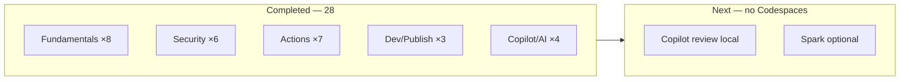

# 🗺️ GitHub Skills Learning Roadmap

> Personal study plan for [**GitHub Foundations**](https://learn.microsoft.com/en-us/credentials/certifications/github-foundations/) prep.  
> **Account:** GitHub Pro · **Logged practices:** 28 · **Last updated:** Deploy to Azure added  
> **Constraint:** Codespaces quota exhausted — prefer browser / local-clone practices for now

---

## Progress overview



| Track | Logged | Notes |
|:------|:------:|:------|
| 🌱 Fundamentals | 8 | — |
| 🛡️ Security | 6 | — |
| ⚙️ Automation | 7 | — |
| ☁️ Dev & Publishing | 3 | — |
| 🤖 Copilot & AI | 4 | +1 excluded (`agentic-workflows…`) |

---

## How to run any practice (repeatable workflow)

| Step | Action |
|:----:|:-------|
| 1 | Go to [skills.github.com](https://skills.github.com/) or the `@skills` repo linked below |
| 2 | Click **Use this template** → **Create a new repository** |
| 3 | Choose **Public** (unlimited Actions minutes; recommended on Pro) |
| 4 | Open **Issues** — Mona posts Step 1 within ~20 seconds |
| 5 | Follow each issue/comment; open PRs when asked |
| 6 | Close the final issue → exercise complete |
| 7 | Ask to update [README.md](README.md) — new row + count bump |

**Codespaces tip:** If a skill asks for Codespaces, use **Local** clone + your editor instead (or skip until quota resets).

---

## Phase A — Collaboration & Git depth *(complete)*

| Order | Practice | Status |
|:-----:|:---------|:-------|
| ~~**1**~~ | ~~[Connect the dots](https://github.com/skills/connect-the-dots)~~ | ✅ [`skills-connect-the-dots`](https://github.com/blackhebrewisraeli/skills-connect-the-dots) |
| ~~**2**~~ | ~~[Release-based workflow](https://github.com/skills/release-based-workflow)~~ | ✅ [`skills-release-based-workflow`](https://github.com/blackhebrewisraeli/skills-release-based-workflow) |
| ~~**3**~~ | ~~[Change commit history](https://github.com/skills/change-commit-history)~~ | ✅ [`skills-change-commit-history`](https://github.com/blackhebrewisraeli/skills-change-commit-history) |

---

## Phase B — Security track *(complete)*

| Order | Practice | Status |
|:-----:|:---------|:-------|
| ~~**4**~~ | ~~[Configure CodeQL language matrix](https://github.com/skills/configure-codeql-language-matrix)~~ | ✅ [`skills-configure-codeql-language-matrix`](https://github.com/blackhebrewisraeli/skills-configure-codeql-language-matrix) |
| ~~**5**~~ | ~~[Secure Code Game](https://github.com/skills/secure-code-game)~~ | ✅ [`skills-secure-code-game`](https://github.com/blackhebrewisraeli/skills-secure-code-game) |

---

## Phase C — Actions track *(complete)*

| Practice | Status |
|:---------|:-------|
| ~~[Test with Actions](https://github.com/skills/test-with-actions)~~ | ✅ [`skills-test-with-actions`](https://github.com/blackhebrewisraeli/skills-test-with-actions) |
| ~~[Publish Docker Images](https://github.com/skills/publish-docker-images)~~ | ✅ [`skills-publish-docker-images`](https://github.com/blackhebrewisraeli/skills-publish-docker-images) |
| ~~[AI in Actions](https://github.com/skills/ai-in-actions)~~ | ✅ [`skills-ai-in-actions`](https://github.com/blackhebrewisraeli/skills-ai-in-actions) |

---

## Phase D — Copilot polish *(requires Copilot; prefer local editor)* ← **NEXT**

| Order | Practice | Duration | Status |
|:-----:|:---------|:--------:|:-------|
| ~~**7**~~ | ~~[Getting started with GitHub Copilot](https://github.com/skills/getting-started-with-github-copilot)~~ | ~30 min | ✅ [`skills-getting-started-with-github-copilot`](https://github.com/blackhebrewisraeli/skills-getting-started-with-github-copilot) |
| **8** | [Copilot code review](https://github.com/skills/copilot-code-review) | ~30 min | **→ Next** · [Start →](https://github.com/skills/copilot-code-review) · **clone locally, skip Codespaces** |
| **9** | [Customize your GitHub Copilot experience](https://github.com/skills/customize-your-github-copilot-experience) | ~45 min | [Start →](https://github.com/skills/customize-your-github-copilot-experience) · **local editor** |

**Optional stretch:**

- [Build applications with Copilot agent mode](https://github.com/skills/build-applications-w-copilot-agent-mode)
- [Your first extension for GitHub Copilot](https://github.com/skills/your-first-extension-for-github-copilot)

---

## Phase E — Optional / situational

| Practice | Status / notes | Codespaces? |
|:---------|:---------------|:------------|
| ~~[Deploy to Azure](https://github.com/skills/deploy-to-azure)~~ | ✅ [`skills-deploy-to-azure`](https://github.com/blackhebrewisraeli/skills-deploy-to-azure) | Done (local/browser) |
| [Idea to App with Spark](https://github.com/skills/idea-to-app-with-spark) | If Spark is available on your account | Usually no |
| [Copilot + Codespaces + VS Code](https://github.com/skills/copilot-codespaces-vscode) | After Codespaces quota resets | **Yes — skip for now** |
| [Migrate ADO repository](https://github.com/skills/migrate-ado-repository) | Azure DevOps migration | **Yes — skip for now** |

**Skip for now:** Copilot Spaces, Expand team with Copilot (org/Business), Migrate ADO, Copilot+Codespaces.

---

## Recommended weekly pace

| Week | Target | Practices |
|:----:|:-------|:----------|
| **1** | Phase A | ~~Connect the dots ✓~~ · ~~Release workflow ✓~~ · ~~Change commit history ✓~~ |
| **2** | Phase B + C | ~~CodeQL matrix ✓~~ · ~~Secure Code Game ✓~~ · ~~Test + Docker ✓~~ · ~~AI in Actions ✓~~ |
| **3** | Phase D (local) | ~~Getting started Copilot ✓~~ · **Copilot code review** · Customize |
| **4** | Optional | ~~Deploy to Azure ✓~~ · exam review |

---

## GitHub Pro tips (avoid hitting limits)

- **Always use public repos** for Skills exercises when possible.
- **Private repo Actions** count against 3,000 min/month on Pro.
- **Codespaces:** quota exhausted — use local clone until it resets.
- **CodeQL / secret scanning skills:** work best on **public** repos on individual Pro accounts.

---

## Checklist — copy as you go

```
Phase A
[x] Connect the dots
[x] Release-based workflow
[x] Change commit history

Phase B
[x] Configure CodeQL language matrix
[x] Secure Code Game

Phase C
[x] Add test-with-actions to README
[x] Add publish-docker-images to README
[x] AI in Actions

Phase D (local editor — no Codespaces)
[x] Getting started with GitHub Copilot
[ ] Copilot code review
[ ] Customize GitHub Copilot experience

Phase E
[x] Deploy to Azure
[ ] (optional) Idea to App with Spark
```

---

<sub>See completed work in [README.md](README.md) · Maintained by <a href="https://github.com/blackhebrewisraeli">@blackhebrewisraeli</a></sub>
