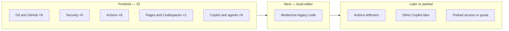

# Leftover practice

What I have **not** finished yet, and what I am running next.

This is a personal queue for [GitHub Skills](https://learn.github.com/skills/) exercises. It is not a study plan for any exam or credential.

**Account notes:** GitHub Pro · Codespaces quota exhausted — prefer browser or local clone  
**Active catalog:** 40 · **Finished:** 32 · **In progress:** 1 · **Not started:** 7  
**Last updated:** 27 August 2026 (logged Copilot agent mode)



---

## Next

**[Modernize your legacy code with GitHub Copilot](https://github.com/skills/modernize-your-legacy-code-with-github-copilot)** — not started · **local editor, skip Codespaces** · official write-up: under 30 minutes

| | |
|:--|:--|
| Official course | https://github.com/skills/modernize-your-legacy-code-with-github-copilot |
| One-click public copy | [Create `skills-modernize-your-legacy-code-with-github-copilot`](https://github.com/new?template_owner=skills&template_name=modernize-your-legacy-code-with-github-copilot&owner=%40me&name=skills-modernize-your-legacy-code-with-github-copilot&description=Exercise:+Modernize+Your+Legacy+Code+with+GitHub+Copilot&visibility=public) |
| Prerequisite I already finished | [Getting started with GitHub Copilot](https://github.com/blackhebrewisraeli/skills-getting-started-with-github-copilot) |
| What this one covers | Explain legacy code, sketch data flow, generate modern snippets with Copilot, replace and test |

**How I will run it**

1. Open the one-click public copy link above (keep the repo **public**).
2. Wait ~20 seconds, then open **Issues** and refresh until Step 1 appears.
3. If the course offers Codespaces, clone locally and use the editor I already have.
4. Work the steps Mona posts; close them as they complete.
5. When the last issue closes, tell the log to mark this finished.

Do not start a second leftover course until this copy is finished (or log it the same day in [CATALOG.md](CATALOG.md)).

---

## Open queue (everything not finished)

### Ready when I am (no extra product beyond Copilot / public Actions)

| Course | Status | Track |
|:-------|:-------|:------|
| [Modernize your legacy code with GitHub Copilot](https://github.com/skills/modernize-your-legacy-code-with-github-copilot) | Not started · **Next** | Copilot |
| [Workflow artifacts](https://github.com/skills/workflow-artifacts) | Not started | Actions |
| [Ship with quality](https://github.com/skills/ship-with-quality) | Not started | Actions |
| [Idea to Merge with the Copilot App](https://github.com/skills/idea-to-merge-with-the-copilot-app) | Not started | Copilot App |

### Depends on a product or quota I may not have

| Course | Status | Why it is waiting |
|:-------|:-------|:------------------|
| [Expand your team with Copilot](https://github.com/skills/expand-your-team-with-copilot) | Not started · Parked | Copilot coding agent / usually org or team access |
| [Scale institutional knowledge using Copilot Spaces](https://github.com/skills/scale-institutional-knowledge-using-copilot-spaces) | Not started · Parked | Copilot Spaces |
| [Idea to App with Spark](https://github.com/skills/idea-to-app-with-spark) | Not started | Spark has to be available on the account |
| [Migrate ADO repository](https://github.com/skills/migrate-ado-repository) | In progress · Parked | Copy: [skills-migrate-ado-repository](https://github.com/blackhebrewisraeli/skills-migrate-ado-repository). Codespaces and an Azure DevOps sample. Revisit after quota resets if I still want the migration practice. |

### Not queued (official course archived)

| Course | Why it is not leftover practice |
|:-------|:--------------------------------|
| [Copilot + Codespaces + VS Code](https://github.com/skills/copilot-codespaces-vscode) | Archived by GitHub |
| [Your first extension for GitHub Copilot](https://github.com/skills/your-first-extension-for-github-copilot) | Archived by GitHub |

---

## Already finished (do not re-queue)

Full table: [CATALOG.md](CATALOG.md). Short list:

- **Git & GitHub (8):** Introduction to GitHub, Introduction to Git, Markdown, Review PRs, Connect the Dots, Resolve Merge Conflicts, Change Commit History, Release-based Workflow
- **Security (6):** Repository Management, Supply Chain, Secret Scanning, CodeQL, CodeQL language matrix, Secure Code Game
- **Actions (8):** Hello Actions, Test with Actions, Reusable Workflows, JavaScript Actions, Docker images, Deploy to Azure, AI in Actions, AI-powered Actions
- **Publishing (2 extra):** Codespaces, GitHub Pages *(Deploy to Azure counted under Actions)*
- **Copilot / agents (8):** Getting started with Copilot, Copilot CLI, MCP + Copilot, Agent orchestration, Agentic workflows that read the room, Copilot code review, Customize Copilot, Copilot agent mode

---

## How I run any leftover course

| Step | Action |
|:----:|:-------|
| 1 | Open [learn.github.com/skills](https://learn.github.com/skills/) or the `@skills` repo above |
| 2 | **Use this template** → **Create a new repository** |
| 3 | Make it **Public** (private-repo Actions minutes are limited) |
| 4 | Open **Issues** — Step 1 usually appears within ~20 seconds |
| 5 | Do the work Mona asks (edit, commit, PR) |
| 6 | When the last step closes, update [CATALOG.md](CATALOG.md), [README.md](README.md), and [KNOWLEDGE.md](KNOWLEDGE.md), then delete the row here |

If the course wants Codespaces: clone locally and use the editor I already have, or skip until quota resets.

---

## Working notes that are not “academy leftover”

These are environment reminders, not courses:

- Prefer **public** practice repos so Actions, CodeQL, and secret scanning behave the way the exercise expects on an individual Pro account.
- Private-repo Actions count against the monthly minutes on Pro.
- Do not start a second in-progress copy while Modernize legacy code is still open, unless I also log it in [CATALOG.md](CATALOG.md) the same day.

---

## Checklist I copy from when I sit down to practice

```
Next
[x] Copilot code review
[x] Customize Copilot experience
[x] Build applications with Copilot agent mode
[ ] Modernize legacy code with Copilot

Actions leftovers
[ ] Workflow artifacts
[ ] Ship with quality

Copilot leftovers I can start without extra products
[ ] Idea to Merge with the Copilot App

Waiting on access or quota
[ ] Expand team with Copilot
[ ] Copilot Spaces
[ ] Idea to App with Spark
[ ] Migrate ADO repository       (copy already exists)
```

<sub>Personal queue · see finished work in [README.md](README.md) · <a href="https://github.com/blackhebrewisraeli">@blackhebrewisraeli</a></sub>
